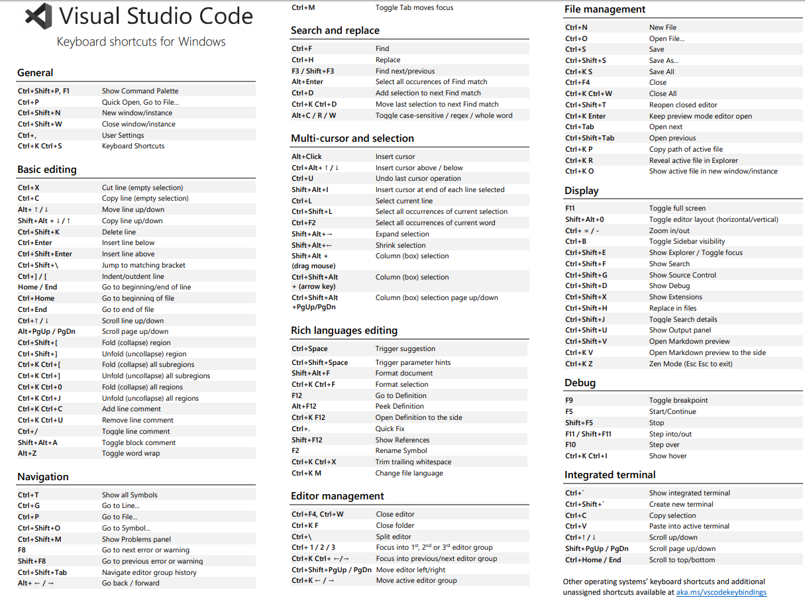

###快捷键

    ctrl+k c        快速注释
    ctrl + c        终止
    alt +shif +f    整理代码
    !               一键HTML模板
    ctrl+shift+p    打开vscode命令
    ctrl+alt+v      粘贴截切版中的内容(在配置文件中设置Paste Image:Path项为:${currentFileDir}/img/)
    alt+b           打开chrome

    ctrl+/   注释单行html

    alt+L O  打开服务器-Live Server
    alt+L C  停止服务器-Live Server

    ctrl d   选中关键字修改
    ctrl+k f 格式化HTML对齐选中代码第一行

    div#app 可以直接创建id为app的Div元素

    

